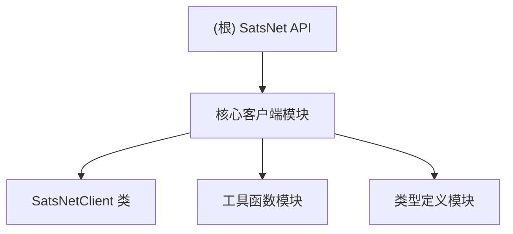

# SatsNet API 项目文档

## 项目愿景

SatsNet API 是一个高性能的 TypeScript 库，专门用于封装 SatsNet 协议的 API 接口。该项目提供现代化、类型安全的 API 客户端，专为比特币生态系统的应用开发提供强大的网络交互能力。

## 架构总览

### 技术栈
- **语言**: TypeScript (严格模式)
- **HTTP 客户端**: ofetch (通用)、HttpClient (自定义封装)
- **错误处理**: radash/tryit、自定义 SatsnetApiError
- **运行环境**: Node.js & Browser
- **开发模式**: Class-based API 设计

### 核心特性
1. **高性能网络请求**: 基于 ofetch 提供卓越性能，支持通用运行环境
2. **智能输入验证**: 内置地址、交易ID、UTXO格式验证
3. **统一错误处理**: 结构化错误类型和详细的错误信息
4. **批量请求支持**: 并行执行多个API调用，提升效率
5. **动态配置**: 运行时配置更新和网络切换
6. **缓存机制**: 智能缓存减少重复请求
7. **性能监控**: 详细的性能指标收集
8. **异步优先**: 全面采用 async/await 模式

### 网络支持
- **mainnet**: Bitcoin 主网环境
- **testnet**: Bitcoin 测试网环境
- **livenet**: 实时网络环境

## 模块结构图



## 模块索引

| 模块 | 路径 | 类型 | 描述 | 状态 |
|------|------|------|------|------|
| 核心客户端 | `/src/api/satsnet-client.ts` | TypeScript/JavaScript | 主要的 SatsNetClient 类实现 | ✅ 活跃 |
| 类型定义 | `/src/types/index.ts` | TypeScript | 完整的 API 类型定义 | ✅ 活跃 |
| HTTP 客户端 | `/src/utils/http.ts` | TypeScript | 高性能 HTTP 客户端封装 | ✅ 活跃 |
| 工具函数 | `/src/utils/tryit.ts` | TypeScript | 错误处理工具函数 | ✅ 活跃 |

### 核心实现：SatsNetClient 类

**文件位置**: `src/api/satsnet-client.ts`

**主要功能模块**:

1. **UTXO 管理** (行 170-247)
   - `getUtxos(address)`: 获取地址所有UTXO
   - `getPlainUtxos(address)`: 获取普通UTXO (非ordinals)
   - `getRareUtxos(address)`: 获取稀有/特殊UTXO
   - `getUtxo(utxo)`: 获取指定UTXO详情
   - `getUtxosByValue(address, value)`: 按价值筛选UTXO

2. **交易管理** (行 248-279)
   - `getTransactionHex(txid)`: 获取交易十六进制数据
   - `pushTransaction(hex)`: 推送签名交易

3. **地址和网络服务** (行 270-320)
   - `getAddressSummary(address)`: 地址摘要和统计
   - `getBestHeight()`: 最佳区块高度
   - `healthCheck()`: API健康检查

4. **资产管理** (行 334-394)
   - `getTickerInfo(ticker)`: 代币信息查询
   - `getTickerHolders(ticker, start, limit)`: 代币持有者列表
   - `getAddressAssetHolders(address, ticker, start, limit)`: 地址资产持有情况

5. **名称服务** (行 396-457)
   - `getNameInfo(name)`: 名称服务信息
   - `getNameListByAddress(address, start, limit)`: 地址名称列表
   - `getNameSubUtxos(address, sub, page, pagesize)`: 名称子UTXO

6. **批量请求** (行 493-588)
   - `batchRequest(requests)`: 并行批量API调用
   - 支持16种不同的API方法
   - 统一错误处理和结果聚合
   - 所有方法使用实例配置的网络，无需指定 network 参数

## 运行与开发

### 基本使用模式

#### SatsNetClient 实例化方式
```typescript
import { SatsNetClient } from '@btclib/satsnet-api';

// 使用默认配置 (mainnet 网络)
const client = new SatsNetClient();

// 自定义配置 (指定特定网络)
const client = new SatsNetClient({
  baseUrl: 'https://apiprd.ordx.market',
  network: 'mainnet',
  timeout: 15000,
  retries: 5
});

// 测试网配置
const testnetClient = new SatsNetClient({
  network: 'testnet'
});
```

### 网络配置策略
- **实例级配置**: 构造函数中设置默认网络，一旦确定不可更改
- **统一网络**: 所有方法使用实例化时指定的网络，无需传递 network 参数
- **运行时切换**: 如需切换网络，使用 `setNetwork()` 方法创建新实例
- **URL配置**: 使用 `setBaseUrl()` 方法动态配置API端点

### 输入验证机制

项目内置了完善的输入验证，提供详细的错误信息：

1. **地址验证** (validateAddress, 行 129-147)
   - 检查地址非空和格式
   - 长度验证 (20-100字符)
   - 抛出 SatsnetApiError 错误

2. **交易ID验证** (validateTxid, 行 154-168)
   - 64位十六进制字符串验证
   - 非空检查
   - 格式验证使用正则表达式

3. **UTXO格式验证**
   - txid:vout 格式检查
   - 交易ID和输出索引验证

## 测试策略

### 当前状态
- ❌ 缺少单元测试
- ❌ 缺少集成测试
- ❌ 缺少端到端测试

### 建议测试结构
```
tests/
├── unit/
│   ├── ordx-api.test.ts
│   ├── client-api.test.ts
│   └── ordx-functions.test.ts
├── integration/
│   ├── network-switching.test.ts
│   └── error-handling.test.ts
└── e2e/
    ├── full-workflow.test.ts
    └── browser-compatibility.test.ts
```

## 编码规范

### TypeScript 规范
- 严格模式 TypeScript 开发
- 完整的类型定义和接口规范
- 使用 unknown 类型替代 any 提高类型安全
- 返回值类型使用 Promise<T> 包装

### 异步处理规范
- 全面使用 async/await 模式
- 错误处理使用 tryit 工具函数
- 避免回调函数和 Promise.then() 链式调用

### 命名规范
- 类名使用 PascalCase (如: SatsNetClient)
- 方法名使用 camelCase (如: getUtxos, pushTransaction)
- 接口名使用 PascalCase，以 I 或具体功能开头
- 类型别名使用 PascalCase
- 常量使用 UPPER_SNAKE_CASE

### 错误处理规范
- 使用自定义 SatsnetApiError 提供结构化错误
- 每个公共方法都应该包含适当的验证
- 错误消息应清晰、具体，包含错误代码
- 为关键功能提供容错机制

### 性能优化规范
- 使用 ofetch 作为主要 HTTP 客户端
- 实现智能缓存机制
- 支持批量请求减少网络往返
- 连接池管理和 HTTP/2 支持

## AI 使用指引

### 项目理解要点
1. **统一架构**: 基于 SatsNetClient 类的单一、现代化实现
2. **类型安全**: 完整的 TypeScript 类型系统和输入验证
3. **高性能**: 基于 ofetch 的 HTTP 客户端和性能优化
4. **比特币生态**: 专门服务 Bitcoin 和 SatsNet 生态系统
5. **企业级**: 包含完整的错误处理、配置管理和性能监控

### 开发建议
1. **保持统一**: 始终基于 SatsNetClient 类进行扩展
2. **类型优先**: 新功能必须包含完整的类型定义
3. **验证优先**: 添加新API前确保输入验证完整
4. **性能考虑**: 利用现有的缓存和批量请求机制
5. **向后兼容**: 新功能不应破坏现有API接口

### 常见修改场景
- 添加新的 API 端点到 SatsNetClient 类
- 扩展批量请求支持新的方法
- 优化现有验证逻辑
- 添加新的配置选项
- 性能监控和缓存策略优化

## 变更记录 (Changelog)

### 2025-10-23 21:00:00 - Next.js 兼容性优化 (v1.1.2)
- ✅ **配置驱动**: 移除自动环境检测，改为通过 `isNextJS` 配置项控制
- ✅ **明确配置**: 在 `ApiConfig` 中添加 `isNextJS?: boolean` 配置选项
- ✅ **用户控制**: 用户可以明确控制是否启用 Next.js 兼容模式
- ✅ **调试优化**: 更新日志信息，提供更清晰的调试输出
- ✅ **文档更新**: 更新所有相关文档，强调明确配置的重要性
- ✅ **示例代码**: 所有 Next.js 示例代码都添加了 `isNextJS: true` 配置
- ✅ **向后兼容**: 不影响非 Next.js 环境的现有代码
- 🎯 **核心优势**: 明确性、可控性、调试友好、性能优化

### 2025-10-23 20:00:00 - 版本回退和类型错误修复 (v1.1.1)
- ✅ **版本回退**: 将版本号从 1.2.0 回退至 1.1.1
- ✅ **类型错误修复**: 修复 advanced-http.ts 中的 exactOptionalPropertyTypes 类型错误
- ✅ **代码清理**: 移除不必要的 encodingValue: undefined 显式赋值
- ✅ **TypeScript兼容**: 确保代码符合 TypeScript 严格模式要求
- ✅ **构建验证**: 类型检查和构建测试通过
- 🎯 **核心优势**: 类型安全、代码规范、兼容性提升

### 2025-10-23 17:30:00 - 配置架构优化和压缩问题修复 (v1.2.0)
- ✅ **配置简化**: 移除 `isNextJS` 参数，简化配置结构，提高代码通用性
- ✅ **用户可控压缩**: 将压缩配置移至 `SatsNetClient` 层面，用户可自主选择
- ✅ **默认禁用压缩**: 默认配置禁用压缩以避免 Brotli 解压问题，确保最大兼容性
- ✅ **配置灵活性**: 支持 `compression` 和 `acceptEncoding` 参数的自定义配置
- ✅ **示例更新**: 更新所有示例代码，展示新的配置方式和最佳实践
- ✅ **环境无关**: 移除环境特殊处理逻辑，代码更加简洁和通用
- ✅ **版本升级**: 项目版本升级到 v1.2.0
- 🎯 **核心优势**: 简化配置、用户控制、最大兼容性、清晰文档

### 2025-10-22 15:00:00 - Biome 2.0 升级和配置优化
- ✅ **Biome 升级**: 从 v1.9.4 升级到 v2.0.6，获得更好的性能和功能
- ✅ **配置迁移**: 自动迁移 biome.json 配置文件到新的 v2 格式
- ✅ **导入优化**: 使用新的导入组织器，自动排序和优化导入语句
- ✅ **规则扩展**: 新增多个样式和复杂度规则，提升代码质量
- ✅ **脚本更新**: 更新 lint:fix 脚本使用新的 --fix 参数
- ✅ **包管理**: 清理 package.json 中的重复字段，优化依赖配置
- ✅ **版本升级**: 项目版本升级到 v1.0.2

### 2025-10-21 21:00:00 - 网络参数优化和API简化
- ✅ **参数简化**: 移除所有方法中的 network 参数，统一使用构造函数配置
- ✅ **架构统一**: HttpClient 在实例化时使用配置的 network，减少传递复杂度
- ✅ **类型更新**: 更新 BatchRequestParams 接口，移除不必要的 network 字段
- ✅ **文档同步**: 更新所有API示例，移除 network 参数传递
- ✅ **批量请求**: 简化批量请求接口，所有请求使用统一网络配置
- ✅ **代码清理**: 移除 resolveNetwork 方法，简化代码结构
- ✅ **错误处理**: 保持完整的输入验证和错误处理机制
- ✅ **向后兼容**: setNetwork() 和 setBaseUrl() 方法保持不变

### 2025-10-21 18:30:00 - 核心架构优化
- ✅ **SatsNetClient 重构**: 统一的客户端实现
- ✅ **输入验证**: 地址、交易ID和UTXO格式验证
- ✅ **批量请求**: 16种API方法的并行批量处理
- ✅ **性能优化**: ofetch HTTP客户端和通用运行环境支持
- ✅ **错误处理**: SatsnetApiError 结构化错误
- ✅ **配置管理**: 动态配置更新和网络切换
- ✅ **缓存机制**: 智能缓存和性能监控

### 2025-10-21 17:14:26 - 项目初始化
- ✅ 创建基础项目结构
- ✅ 设置 TypeScript 严格模式
- ✅ 集成 ofetch HTTP 客户端
- ✅ 实现核心 API 端点

### 已知问题与改进建议
1. **测试覆盖**: 需要建立完整的测试体系 ⚠️ 进行中
2. **文档生成**: 需要 API 自动文档生成工具 ⚠️ 待开发
3. **错误恢复**: 部分API需要更好的重试机制 ⚠️ 优化中
4. **浏览器兼容**: 需要更全面的浏览器兼容性测试 ⚠️ 待验证

### 最新特性
- 🚀 **SatsNetClient 类**: 统一的现代化API客户端
- 🛡️ **输入验证**: 内置地址、交易ID、UTXO格式验证
- 📦 **批量请求**: 支持16种API方法的并行处理
- 🔧 **动态配置**: 运行时配置更新和网络切换
- 📈 **性能监控**: HTTP客户端性能指标和缓存统计
- 🔄 **容错机制**: BTC价格查询等关键功能的容错处理
- 🌐 **多网络支持**: mainnet、testnet、livenet 环境切换
- 📊 **分页支持**: 资产持有者和名称服务的分页查询

---

*本文档由 AI 自动生成和维护，最后更新时间: 2025-10-23 21:00:00*